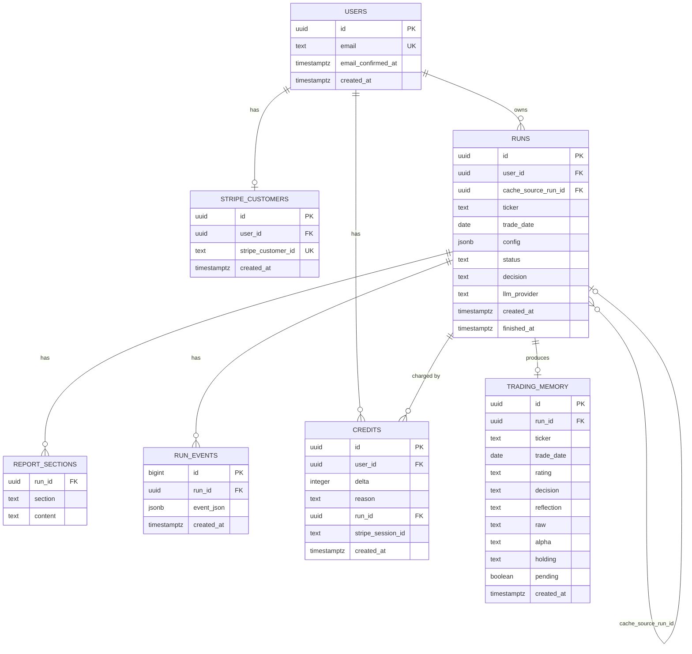

# Entity Relationship Diagram — TradingAgents Hosted Platform

**Date:** 2026-04-26  
**Target:** Supabase Postgres (migration from SQLite)

---

## Diagram



---

## Table Specifications

### `auth.users` — Supabase managed

Managed entirely by Supabase Auth. Do not create or alter directly.

| Column | Type | Notes |
|--------|------|-------|
| `id` | `uuid` | PK — used as FK in all application tables |
| `email` | `text` | Unique, indexed by Supabase |
| `email_confirmed_at` | `timestamptz` | NULL until user verifies email or signs in via OAuth |
| `created_at` | `timestamptz` | Set by Supabase |

---

### `stripe_customers`

Maps each user to a Stripe Customer object. Created lazily on first purchase. Enables Stripe Customer Portal and future subscription management.

| Column | Type | Constraints | Notes |
|--------|------|-------------|-------|
| `id` | `uuid` | PK, default `gen_random_uuid()` | |
| `user_id` | `uuid` | NOT NULL, UNIQUE, FK → `auth.users(id)` ON DELETE CASCADE | One Stripe customer per user |
| `stripe_customer_id` | `text` | NOT NULL, UNIQUE | e.g. `cus_abc123` |
| `created_at` | `timestamptz` | NOT NULL, default `now()` | |

**RLS:**
```sql
ALTER TABLE stripe_customers ENABLE ROW LEVEL SECURITY;
CREATE POLICY "own record" ON stripe_customers
  USING (auth.uid() = user_id);
```

**Index:** `user_id` (unique constraint covers this).

---

### `runs`

Core table — one row per analysis run. Exists today as SQLite; migrated to Postgres with `user_id`, `llm_provider`, and `cache_source_run_id` added.

| Column | Type | Constraints | Notes |
|--------|------|-------------|-------|
| `id` | `uuid` | PK, default `gen_random_uuid()` | Was `TEXT` in SQLite |
| `user_id` | `uuid` | NOT NULL, FK → `auth.users(id)` | NEW — every run owned by a user |
| `cache_source_run_id` | `uuid` | nullable, FK → `runs(id)` | NEW — set when this row is a cache-hit copy; null for original runs |
| `ticker` | `text` | NOT NULL | Uppercased at insert (e.g. `VST`) |
| `trade_date` | `date` | NOT NULL | Analysis date chosen by user |
| `config` | `jsonb` | NOT NULL | Full run config (provider, models, analysts, depth, language) |
| `status` | `text` | NOT NULL, default `'pending'`, CHECK in `('pending','running','done','error')` | |
| `decision` | `text` | nullable, CHECK in `('BUY','OVERWEIGHT','HOLD','UNDERWEIGHT','SELL')` | Set when status → done |
| `llm_provider` | `text` | nullable | Denormalised from config for fast filtering |
| `created_at` | `timestamptz` | NOT NULL, default `now()` | |
| `finished_at` | `timestamptz` | nullable | Set when status → done or error |

**RLS:**
```sql
ALTER TABLE runs ENABLE ROW LEVEL SECURITY;
CREATE POLICY "own runs" ON runs
  USING  (auth.uid() = user_id)
  WITH CHECK (auth.uid() = user_id);
```

**Indexes:**
```sql
CREATE INDEX runs_user_id_idx       ON runs (user_id, created_at DESC);
CREATE INDEX runs_cache_lookup_idx  ON runs (ticker, status, created_at DESC);
-- Used for same-week cache query:
-- WHERE ticker = $1 AND status = 'done'
-- AND DATE_TRUNC('week', created_at) = DATE_TRUNC('week', now())
```

**Cache-hit rows:** When a cache hit occurs, a new `runs` row is inserted for the requesting user with:
- `status = 'done'`, `decision` copied from the source run
- `cache_source_run_id` pointing to the original run
- `finished_at = created_at` (instant)
- No credit is deducted (see `credits` below)
- `report_sections` are NOT duplicated — the frontend resolves sections from `cache_source_run_id` when its own `report_sections` are empty

---

### `report_sections`

Stores each named section of a completed report. Separate table so large markdown content is not loaded on list views.

| Column | Type | Constraints | Notes |
|--------|------|-------------|-------|
| `run_id` | `uuid` | PK (composite), FK → `runs(id)` ON DELETE CASCADE | |
| `section` | `text` | PK (composite) | e.g. `market_report`, `final_trade_decision` |
| `content` | `text` | nullable | Markdown string |

**RLS:** Inherit access through `runs`. No direct RLS needed — always fetched via the `runs` join. Alternatively:
```sql
ALTER TABLE report_sections ENABLE ROW LEVEL SECURITY;
CREATE POLICY "via run ownership" ON report_sections
  USING (
    EXISTS (
      SELECT 1 FROM runs
      WHERE runs.id = report_sections.run_id
        AND runs.user_id = auth.uid()
    )
  );
```

**Index:**
```sql
CREATE INDEX report_sections_run_id_idx ON report_sections (run_id);
```

---

### `run_events`

Append-only log of all SSE events emitted during a run. Used to replay the event stream when a user opens a completed run page. Currently stored in SQLite as `run_events`; column types updated for Postgres.

| Column | Type | Constraints | Notes |
|--------|------|-------------|-------|
| `id` | `bigint` | PK, GENERATED ALWAYS AS IDENTITY | Was `INTEGER AUTOINCREMENT` |
| `run_id` | `uuid` | NOT NULL, FK → `runs(id)` ON DELETE CASCADE | |
| `event_json` | `jsonb` | NOT NULL | Full SSE event payload |
| `created_at` | `timestamptz` | NOT NULL, default `now()` | Was `ts TEXT` in SQLite |

**RLS:** Same pattern as `report_sections` — access gated through run ownership.

**Index:**
```sql
CREATE INDEX run_events_run_id_idx ON run_events (run_id, id ASC);
```

---

### `credits`

Append-only financial ledger. Never update or delete rows — insert only. Balance = `SUM(delta)` for a given user.

| Column | Type | Constraints | Notes |
|--------|------|-------------|-------|
| `id` | `uuid` | PK, default `gen_random_uuid()` | |
| `user_id` | `uuid` | NOT NULL, FK → `auth.users(id)` | |
| `delta` | `integer` | NOT NULL | `+N` for purchases/bonuses, `-1` for run charges |
| `reason` | `text` | NOT NULL, CHECK in `('signup_bonus','purchase','run_charge','cache_hit','admin_adjustment')` | |
| `run_id` | `uuid` | nullable, FK → `runs(id)` | Set when reason = `run_charge` or `cache_hit` |
| `stripe_session_id` | `text` | nullable | Stripe Checkout Session ID; set when reason = `purchase` |
| `created_at` | `timestamptz` | NOT NULL, default `now()` | |

**Constraints:**
```sql
-- Prevent double-charging a single run
CREATE UNIQUE INDEX credits_run_charge_once
  ON credits (run_id)
  WHERE reason = 'run_charge';

-- Prevent crediting the same Stripe session twice
CREATE UNIQUE INDEX credits_stripe_session_once
  ON credits (stripe_session_id)
  WHERE stripe_session_id IS NOT NULL;
```

**RLS:**
```sql
ALTER TABLE credits ENABLE ROW LEVEL SECURITY;
-- Users can read their own credits; all writes use service role (bypass RLS)
CREATE POLICY "own credits" ON credits
  FOR SELECT USING (auth.uid() = user_id);
```

**Balance query (used by run gate and nav bar):**
```sql
SELECT COALESCE(SUM(delta), 0) AS balance
FROM credits
WHERE user_id = $1;
```

**Indexes:**
```sql
CREATE INDEX credits_user_id_idx ON credits (user_id, created_at DESC);
```

---

### `trading_memory`

Replaces the file-based `TradingMemoryLog` used today. Stores the portfolio manager's final decision and reflection after each completed run. Future runs for the same ticker can read this history to inform their analysis.

**Scope: global (not per-user).** All users benefit from the shared memory — a VST analysis run by any user this week informs the next user's VST analysis. No `user_id` column. `run_id` links back to the originating run for audit purposes.

| Column | Type | Constraints | Notes |
|--------|------|-------------|-------|
| `id` | `uuid` | PK, default `gen_random_uuid()` | |
| `run_id` | `uuid` | nullable, UNIQUE, FK → `runs(id)` | Links to the run that produced this entry |
| `ticker` | `text` | NOT NULL | |
| `trade_date` | `date` | NOT NULL | |
| `rating` | `text` | nullable | `'Buy'`, `'Sell'`, `'Hold'`, etc. |
| `decision` | `text` | nullable | Full portfolio manager decision text (markdown) |
| `reflection` | `text` | nullable | Post-hoc reflection on the decision |
| `raw` | `text` | nullable | Raw analysis output |
| `alpha` | `text` | nullable | Alpha insights |
| `holding` | `text` | nullable | Position sizing notes |
| `pending` | `boolean` | NOT NULL, default `true` | `false` once reflection is written |
| `created_at` | `timestamptz` | NOT NULL, default `now()` | |

**RLS:** No RLS — this table is read-only for all users, write-only via service role from the backend.

**Indexes:**
```sql
CREATE INDEX trading_memory_ticker_idx ON trading_memory (ticker, created_at DESC);
```

---

## Signup Credit Trigger

Grants 1 free credit after a user's email is confirmed (covers both email/password + OAuth sign-ups):

```sql
CREATE OR REPLACE FUNCTION grant_signup_credit()
RETURNS TRIGGER LANGUAGE plpgsql SECURITY DEFINER AS $$
BEGIN
  -- Fires on UPDATE when email_confirmed_at transitions NULL → non-null
  IF OLD.email_confirmed_at IS NULL AND NEW.email_confirmed_at IS NOT NULL THEN
    INSERT INTO public.credits (user_id, delta, reason)
    VALUES (NEW.id, 1, 'signup_bonus');
  END IF;
  RETURN NEW;
END;
$$;

CREATE TRIGGER on_email_confirmed
  AFTER UPDATE ON auth.users
  FOR EACH ROW EXECUTE FUNCTION grant_signup_credit();
```

---

## Migration Plan (SQLite → Supabase Postgres)

All existing tables (`runs`, `report_sections`, `run_events`) need a one-time migration:

| Step | Action |
|------|--------|
| 1 | Export SQLite data to CSV/JSON |
| 2 | Run DDL migrations in Supabase (create tables, RLS, indexes) |
| 3 | Backfill `user_id` on existing `runs` rows — set to the owner's UUID or a sentinel "legacy" user |
| 4 | Import CSV/JSON into Supabase via `psql` or Supabase dashboard importer |
| 5 | Update FastAPI `db.py` to use `asyncpg` with `DATABASE_URL` instead of `aiosqlite` |
| 6 | Remove SQLite dependency from `requirements.txt` |

For **dev**: start fresh (no migration needed — dev DB starts empty).  
For **prod**: run migration once before going live; no existing users to worry about at launch.

---

## Summary of New vs Changed

| Table | Status | Change |
|-------|--------|--------|
| `auth.users` | Supabase managed | No change |
| `runs` | Existing → migrated | Add `user_id`, `cache_source_run_id`, `llm_provider`; TEXT id → UUID; TEXT dates → proper types |
| `report_sections` | Existing → migrated | TEXT `run_id` → UUID FK |
| `run_events` | Existing → migrated | INTEGER id → BIGINT identity; TEXT `ts` → TIMESTAMPTZ; TEXT `event_json` → JSONB |
| `credits` | **New** | Core billing ledger |
| `stripe_customers` | **New** | User ↔ Stripe Customer mapping |
| `trading_memory` | **New** | Replaces file-based `TradingMemoryLog` |
